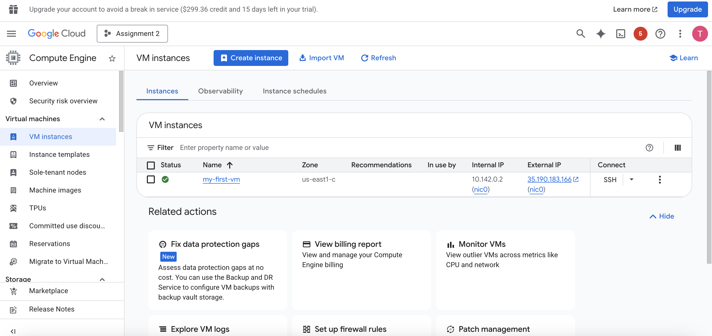
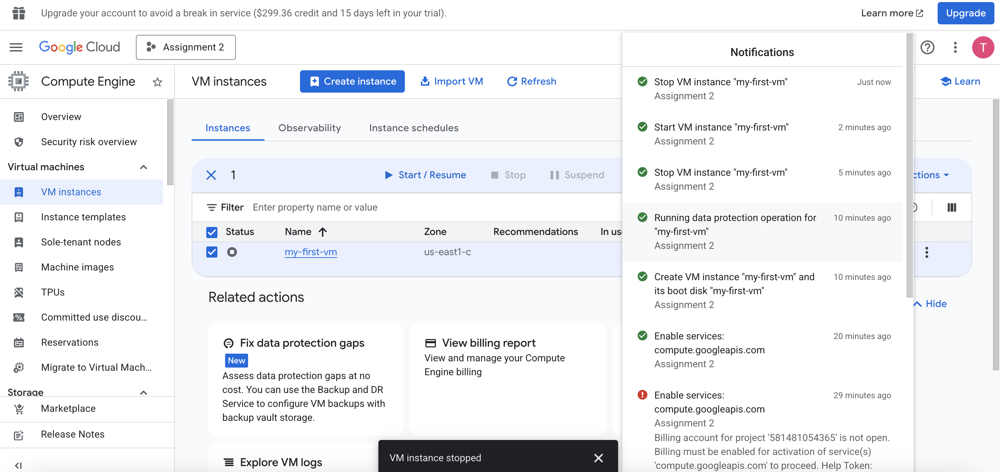

# gcp_oci_vm_start
# AHI 504 — Cloud Foundations for Health Informatics  
## VM Lifecycle Lab: GCP & OCI

### Overview

In this lab, I practiced managing the complete lifecycle of a small virtual machine (VM) on two cloud platforms: Google Cloud Platform (GCP) and Oracle Cloud Infrastructure (OCI). The workflow included creating a minimal VM, starting and stopping it, fully terminating it, and reviewing the differences and similarities between each provider’s process.

This assignment emphasizes core Infrastructure-as-a-Service (IaaS) concepts while reinforcing good cost-management practices by ensuring that no unused resources remain active.

---

### Skills Gained

Through this lab, I gained hands-on experience with:

- Organizing cloud resources using projects and compartments  
- Selecting regions and availability zones  
- Choosing appropriate VM sizes and shapes  
- Configuring basic networking such as public IPs and default VPCs  
- Managing boot disks and cleaning up cloud resources  
- Practicing proper start, stop, and termination procedures  

---

### Learning Objectives

By completing this assignment, I was able to:

- Create, start, stop, and terminate a lightweight VM on both GCP and OCI  
- Compare workflows, terminology, and default configurations across platforms  
- Document the process clearly using Markdown and screenshots so it can be easily replicated  

---

### Constraints & Best Practices

- Accounts: Instructor-provided GCP and OCI access  
- Regions/Zones: Any available region supporting free-tier or minimal instances  
- Instance size: Free-tier eligible or smallest general-purpose VM  
  - GCP example: e2-micro  
  - OCI example: VM.Standard.E2.1.Micro or minimal A1.Flex  
- Operating system: Ubuntu LTS or provider default minimal Linux image  
- Security:
  - No PHI or PII stored on the VM  
  - SSH private keys kept secure and not committed to Git  
- Cost control:
  - All VMs stopped and terminated after use  
  - No leftover disks, snapshots, or IP addresses  

---

## Deliverables

### 1. Screen Recording (5–8 minutes)

The screen recording demonstrates the full VM lifecycle on both platforms, including:

- VM creation and launch  
- Starting and stopping the instance  
- Fully terminating the VM  
- Verifying that all resources were properly cleaned up  

The narration discusses:

- Similarities in workflows and terminology  
- Differences in naming, defaults, quotas, and user interface  
- My platform preference for running a small VM and the reasons behind it

  GCP:
  OCI:

---

### 2. Markdown Tutorial (README.md)

This README acts as a step-by-step guide that another student could follow.

It includes:

- Clear headings and bullet-point instructions  
- At least three screenshots per platform:
  - VM creation page  
  - VM in a running state  
  - Resource list after termination  
- Short notes highlighting common pitfalls or platform differences  

---

## Step-by-Step Process

### Part A — Google Cloud Platform (GCP)

1. Select or create a project and confirm billing is enabled  
2. Choose an available region and zone (for example, us-east1-b)  
3. Navigate to Compute Engine → Create instance  
   - Select the smallest available machine type  
   - Choose Ubuntu LTS as the boot image  
   - Keep the default boot disk size  
   - Use the default VPC and allow SSH access  
   - Assign an ephemeral public IP  
4. Create the VM and wait until the status shows RUNNING
   
   
6. Stop the VM and verify it shows STOPPED or TERMINATED
   
   
8. Delete the VM
   
   

---

### Part B — Oracle Cloud Infrastructure (OCI)

1. Select the default compartment or create a lab-specific compartment  
2. Navigate to Compute → Instances → Create instance  
   - Choose the smallest free-tier eligible shape  
   - Select Ubuntu (or Oracle Linux if Ubuntu is unavailable)  
   - Keep the boot volume at the default minimal size  
   - Attach the instance to an existing VCN and subnet  
   - Assign a public IP if required  
   - Upload an SSH public key if planning to connect  
3. Launch the instance and wait for RUNNING status  
4. Stop the instance and verify it shows STOPPED  
5. Terminate the instance and ensure the boot volume is deleted  
6. Confirm that no compute instances, boot volumes, or public IPs remain  

---

### Submission Details

- Repository name: gcp_oci_vm_start  
- Files included:
  - README.md with embedded screenshots  
  - Link to Loom or Zoom recording at the top of the README  
- Alternate file name (if submitting a single file):  
  lastname_firstname_vm-lifecycle_gcp-oci.md  
- All screenshots redact account IDs and personal information  
